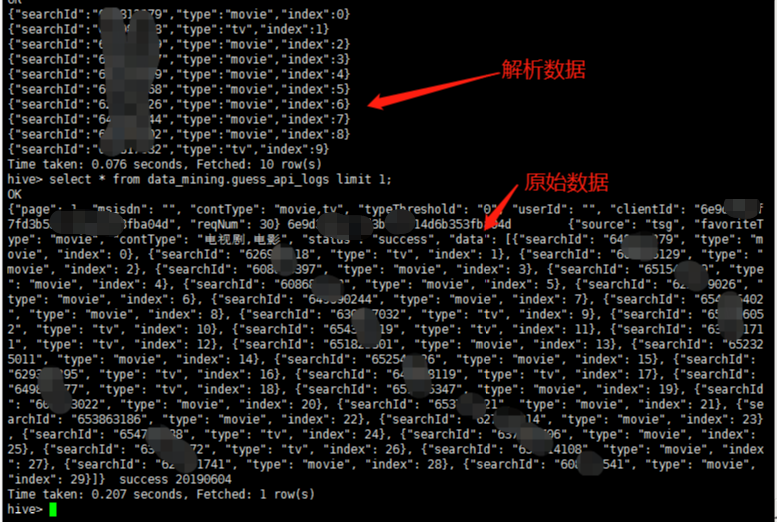

* like查询  
    select * from table where col like '%word%' limit 2;


* 查询建表(查询的时候注意，要指定别名)  
    create table table_name1 as 
    select * from(
    select b.* from(
    select temp_id from table_name2 where dayid=0000 
    union all
    select temp_id from table_name3 where dayid=0000
    ) as a 
    left join (
    select * from table_name4
    ) as b on a.temp_id=b.temp_id
    )as c;


* 查看表结构  
    desc tablename
    
    
* 删除分区  
    alert table tablename drop if exists partition (dayid='0000')


* where 语句判断null  
    is null  或者  is not null 
    

* 解析json数组(https://blog.csdn.net/liweijie231/article/details/81939730)  
    因为原数据是string（并不是真正的数组类型）类型的，所以无法直接使用explode函数
    1. regexp_extract('xxx','^\[(.+)\]$',1) 这里是把需要解析的json数组去除左右中括号，需要注意的是这里的中括号需要两个转义字符\[。
    2. regexp_replace('xxx','\}\,\{', '\}\|\|\{') 把json数组的逗号分隔符变成两根竖线||，可以自定义分隔符只要不在json数组项出现就可以。
     
    
    ```sql
    
    create table temp_pgy1 as 
    select split_data from(
    select regexp_replace(regexp_extract(get_json_object(data_requ, '$.data'),'^\\[(.+)\\]$',1),'\\}\\,\\{', '\\}\\|\\|\\{') as data from data_mining.guess_api_logs limit 1
    )t1 lateral view explode(split(data, '\\|\\|')) idcols as split_data
    ```
    
* collect explode posexplode 的使用 https://my.oschina.net/puwenchao/blog/1863087


* 将数据保存到本地文件  
    insert overwrite local directory '/data'
ROW FORMAT DELIMITED FIELDS TERMINATED BY ','


* 2级排序 不同分类下挑选出不同节目的推荐，一个节目的推荐按得分降序取前5
一个节目有若干推荐，一个节目有一个分类。数据表如下：  
    节目id | 推荐节目id | 推荐分数 |节目分类 | 推荐节目分类
    111   |  222 |  1.2|  搞笑 |   搞笑
    321   |  2345 |  1.2|  搞笑 |   欧美
    111   |  343 |  1.9|  搞笑 |   日韩
    343   |  444 |  0.5|  搞笑 |   亚洲
    ```sql
    select * from (
    select *, row_number() over (partition by 分类) as index2 from (
    select t.* from (
    select t1.*, row_number() over (partition by 节目id order by 得分 desc) as index1 from table_name
    ) t where index1<6 
    ) s1 
    ) s2 where index2<400
    ```
    
* count 统计的时候带有条件：


```sql
统计共有多少有效id，name不为空的时候id才有效
count(distinct if(name IS NULL, 0, id))
```    